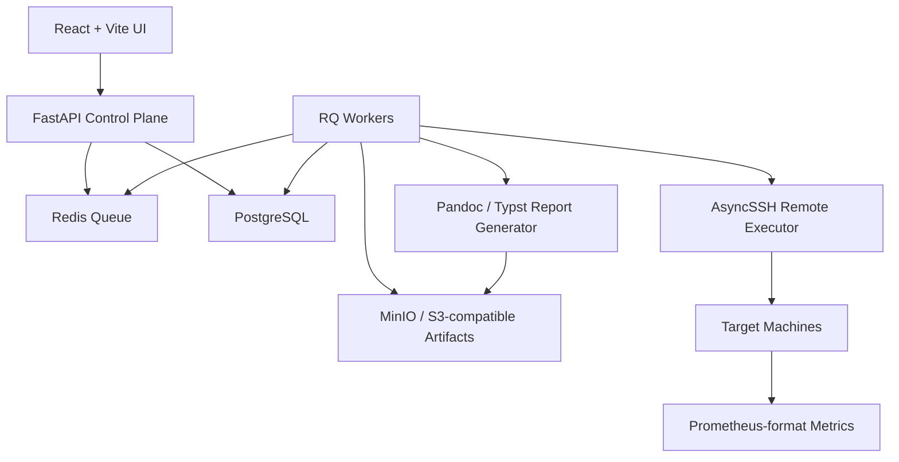
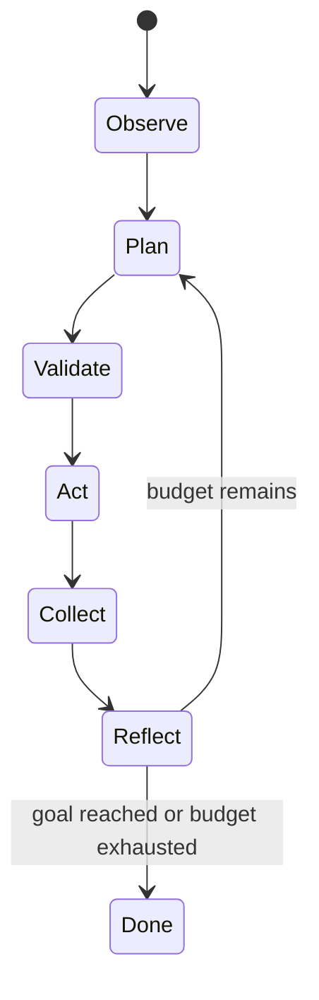

# ModelBench Agent 技术选型文档

> 输入需求：`modelbench_agent_requirements_2.md` v0.4  
> 文档版本：v0.1  
> 编写日期：2026-05-20  
> 目标：为 10 周 MVP 提供可落地、可维护、不过度工程化的技术选型。

## 1. 结论摘要

MVP 选型采用 **Python-first 控制面 + 轻量任务队列 + 自研 SSH 执行器 + PostgreSQL 数据资产库 + React 运维型前端**。

| 层级 | MVP 选型 | 结论 |
|---|---|---|
| 后端 API | Python 3.12+ / FastAPI / Pydantic / SQLAlchemy 2 / Alembic | 首选 |
| 任务队列 | Redis + RQ | 首选，暂不引入 Celery / Temporal |
| 远程执行 | AsyncSSH + rsync + 幂等 Step 模型 | 首选，借鉴 Ansible，不直接依赖 Ansible |
| 主数据库 | PostgreSQL 17/18 | 首选，结构化实验数据核心资产 |
| 时序与指标 | Prometheus exposition 格式 + PostgreSQL 汇总 + MinIO 原始日志 | 首选 |
| 制品存储 | MinIO / S3-compatible object storage | 内部 MVP 可用，外发前需做许可证确认 |
| Benchmark Runner | 自研 Runner + vLLM/SGLang 官方 benchmark 适配 | 首选 |
| Agent 调参 | 自研状态机 + 规则/随机/网格搜索 + LLM 候选生成 | 首选，暂不引入 LangChain / LlamaIndex |
| 智能优化 | Deli_AutoResearch skill | 智能模式协议栈；标准模式不依赖 |
| 前端 | React + Vite + TypeScript + TanStack Query + ECharts | 首选 |
| 国际化 | 前端内置 i18n 字典，中文 + English | 首选 |
| 报告 | Jinja2 + Markdown + Pandoc + Typst PDF engine / DOCX reference template | 首选 |
| 部署 | Docker Compose 单实例 | 首选，暂不引入 Kubernetes |

核心判断：这个项目的难点不在 Web CRUD，而在 **远程机器状态、双运行时一致性、实验可复现、数据可信、失败可诊断**。技术栈应把复杂度留给这几件事。

2026-06-20 更新：实验执行分为 **标准模式** 和 **智能模式**。标准模式先行，参考 `llm_test_tools` 的软件驱动矩阵、progressive 执行和失败剪枝；智能模式后续引入 Deli_AutoResearch 协议做长周期自治、停滞检测、强制 pivot 和 heartbeat watchdog，但不能替代标准模式的可复现数据模型。

## 2. 选型原则

1. **以 3 人 10 周 MVP 为边界**：能少一个服务就少一个服务，能少一个 DSL 就少一个 DSL。
2. **Python 优先**：推理框架、Benchmark、数据处理、LLM 调参、SSH 自动化都在 Python 生态内完成更顺手。
3. **数据资产优先于平台稳定性**：失败可以重跑，但实验参数、日志、指标、启动命令不能丢。
4. **双运行时是一等能力**：container / bare_metal 不能写成两套分叉流程，必须在 RuntimePlugin 层抽象。
5. **幂等可重试，但不做企业级恢复**：每个 Step 能重复执行、能给出清晰失败原因；不做事务回滚、HA、断点续测。
6. **报告可复现**：报告里的命令、镜像 digest、模型 hash、bootstrap profile、runtime mode 必须能还原一次实验。

## 3. 总体架构



控制面只负责状态编排、任务提交、结果归档；真正改变目标机器状态的行为全部走 Remote Executor，并把命令、返回码、stdout/stderr、关键文件快照写入实验记录。

## 4. 后端选型

### 4.1 FastAPI + Python

**选择**：FastAPI 作为 Control Plane API，Python 3.12+ 作为后端主语言。

**原因**：

- 与 vLLM、SGLang、benchmark、数据处理、LLM provider SDK 在同一语言生态。
- FastAPI 原生支持 OpenAPI 文档，MVP 阶段能减少接口沟通成本。
- async API 适合处理任务状态、日志流、SSH 连接调度等 IO 密集场景。
- Pydantic 适合定义机器画像、实验参数、插件参数、LLM 结构化输出。

**不选 Go 作为 MVP 后端**：

- Go 的稳定性很好，但本项目核心依赖 Python ML/LLM 生态，Go 会引入跨语言边界。
- Go 可作为后续高并发 executor 或 agent runner 的重写候选，不作为第一版。

### 4.2 SQLAlchemy 2 + Alembic

**选择**：SQLAlchemy 2 ORM/Core + Alembic migration。

**原因**：

- 实验数据模型会持续演进，必须从第一天就有数据库迁移。
- PostgreSQL JSONB、分区表、索引、upsert 等能力需要比较完整的 SQL 控制力。
- SQLModel 可读性好，但本项目不是简单 CRUD，优先选择 SQLAlchemy 直接能力。

## 5. 数据存储选型

### 5.1 PostgreSQL 作为核心资产库

**选择**：PostgreSQL 17/18。开发环境可用容器版本，生产环境跟随公司内部标准版本锁定。

**核心表建议**：

| 表 | 用途 |
|---|---|
| `machines` | 机器基本信息、当前状态、机型指纹 |
| `machine_snapshots` | 每次探测生成的完整机器画像 JSON |
| `bootstrap_runs` | B1-B7 每次接管记录、profile、模块状态 |
| `experiments` | 一次实验的目标、模型、框架、预算、runtime mode |
| `experiment_trials` | Agent 每轮参数组合、启动命令、结果、失败分类 |
| `metrics_summary` | TTFT/TPOT/P50/P90/P99/吞吐/功耗/显存等聚合指标 |
| `metrics_samples` | 降采样后的关键时序指标，按时间分区 |
| `artifacts` | 日志、报告、快照、原始 metrics JSONL/CSV 的对象存储 URI |
| `models` | 模型来源、格式、hash、缓存路径 |
| `images` | 镜像 tag、digest、分发状态 |

**存储策略**：

- 结构化结论、查询字段、聚合指标进入 PostgreSQL。
- 高频原始时序、框架日志、dmesg、syslog、report assets 进入 MinIO，并在 PostgreSQL 中保留 URI、hash、大小、生成时间。
- `machine_profile`、`framework_params`、`bootstrap_modules` 等变化快的结构用 JSONB，但关键筛选字段要冗余成普通列。
- `metrics_samples` 按月或按周 range partition，避免一年后查询退化。

**暂不引入 TimescaleDB**：

- MVP 的目标是可信记录和报告，不是做大规模时序分析平台。
- PostgreSQL 原生分区足够覆盖 10+ 机器、一机一测的目标。
- 如果后续高频采样和跨年趋势分析变重，再评估 TimescaleDB。

### 5.2 MinIO / S3-compatible 对象存储

**选择**：内部 MVP 使用 MinIO 或公司已有 S3-compatible 对象存储。

**用途**：

- 模型权重清单和校验产物。
- Docker image manifest / tar 包索引。
- Bootstrap 前后快照。
- 原始日志、原始 metrics、报告 PDF/DOCX。

**注意**：MinIO 社区版是 AGPLv3。内部 R&D 使用问题较小，但如果平台未来随一体机交付给客户，需要由法务/产品确认许可证策略，或切换到公司已批准的 S3-compatible 存储。

## 6. 任务调度选型

### 6.1 Redis + RQ

**选择**：Redis + RQ 作为 MVP 后台任务队列。

**适用任务**：

- 机器探测。
- B1-B7 Bootstrap。
- 模型同步。
- 单次 benchmark。
- Agent tuning trial。
- 报告生成。

**原因**：

- RQ 模型简单，任务就是 Python 函数，符合内部工具定位。
- 当前需求明确不做断点续测、复杂 retry、HA、SLA，Celery/Temporal 的收益不够覆盖复杂度。
- 对 10+ 目标机器、一机一测的规模，单 Redis + 多 worker 足够。

**约束**：

- 任务默认不自动重试；失败后记录失败分类和下一步建议，由用户手动重跑。
- 每个远程 Step 自己保证幂等，不能依赖队列重试来掩盖状态不确定。
- 长任务必须周期性写 heartbeat / progress，供 UI 展示。

**升级路径**：

- 如果后续需要跨天工作流、人工审批节点、强恢复，再评估 Temporal。
- 如果后续有大量异构队列和周期任务，再评估 Celery。

## 7. Remote Executor 选型

### 7.1 AsyncSSH + rsync + 幂等 Step

**选择**：基于 AsyncSSH 自研轻量 executor，文件分发使用 rsync / scp，任务模型参考 Ansible 的幂等模块思想。

**原因**：

- 目标机器通过 SSH 纳管，AsyncSSH 与 FastAPI / asyncio 生态一致。
- 需求强调“自研轻量 SSH executor，参考 Ansible playbook 模式”，而不是直接把 Ansible 作为核心运行时。
- 直接控制 stdout/stderr、exit code、实时日志流、sudo、pty、文件快照，更方便做失败诊断和报告复现。

**Step 接口建议**：

```python
class RemoteStep(Protocol):
    id: str
    name: str

    async def detect(self, ctx: StepContext) -> StepDetection: ...
    async def apply(self, ctx: StepContext) -> StepResult: ...
    async def verify(self, ctx: StepContext) -> StepVerification: ...
```

**StepResult 必须包含**：

| 字段 | 说明 |
|---|---|
| `status` | `skipped / changed / failed` |
| `commands` | 实际执行命令、cwd、env、sudo 信息 |
| `stdout_uri` / `stderr_uri` | 大日志写对象存储 |
| `exit_code` | 远程命令返回码 |
| `changed_files` | 被修改的关键配置文件 |
| `snapshots` | 如 `lsblk`、`nvidia-smi`、`docker info` |
| `failure_hint` | 面向工程师的下一步建议 |

**不直接依赖 Ansible 的原因**：

- Ansible 对通用配置管理很好，但本项目需要围绕实验记录、报告、失败分类做更细粒度的结构化输出。
- 目标不是构建通用运维平台，而是把少数高价值动作做扎实。
- 可以复用 Ansible 的思想：模块幂等、changed/skipped/failed、task name、handler；不引入完整生态负担。

## 8. Bootstrap / Provisioning 实现方式

### 8.1 模块边界

按照需求文档的 B1-B7 保持模块边界：

| 模块 | MVP 实现策略 |
|---|---|
| B1 Access | Python Step + shell 命令，重点处理备份 SSH 连接和平台公钥注入 |
| B2 Source | Jinja2 模板生成 sources/pip/npm/docker/HF 配置 |
| B3 Package | apt + uv/conda/pyenv 策略先做最短路径，记录版本 |
| B4 Storage | 探测与挂载分开；LVM 扩容必须记录 pre snapshot |
| B5 Container | Docker CE + registry mirror + image manifest/digest |
| B6 Tuning | MVP 不做 profile，只保留 baseline 和探测字段 |
| B7 Bare-metal | venv/conda 环境 + pip 安装 vLLM/SGLang，记录 freeze |

### 8.2 Baseline 恢复

MVP 不做自动回滚，但每个可逆配置要有 `restore_hint`：

- 写入配置前保存 `.inflab.bak.<timestamp>`。
- 记录修改前 `sha256`。
- 报告中列出“本次改动过哪些系统文件”。
- 测试结束的 baseline reset 只做必要清理：停止服务、清理临时进程、释放端口、恢复环境变量、卸载临时挂载。

## 9. 插件系统选型

### 9.1 Python import-time 插件注册

**选择**：Python 抽象基类/Protocol + import-time registry。MVP 不做插件热加载。

```python
class FrameworkPlugin(Protocol):
    name: str
    supported_runtime_modes: set[RuntimeMode]

    async def install(self, runtime: RuntimePlugin, spec: FrameworkSpec) -> InstallResult: ...
    async def start_server(self, runtime: RuntimePlugin, run: RunSpec) -> ServerHandle: ...
    async def health_check(self, handle: ServerHandle) -> HealthStatus: ...
    async def collect_metrics(self, handle: ServerHandle) -> MetricsBundle: ...
    async def parse_logs(self, logs: str) -> list[StructuredEvent]: ...
    async def stop(self, handle: ServerHandle) -> None: ...
```

**原因**：

- 第一版插件数量很少：vLLM、SGLang、NVIDIA driver/runtime、模型分发。
- 热加载不会提升 MVP 交付价值，反而会制造生命周期和兼容性问题。
- 使用 Pydantic 定义插件 spec，便于 API/UI/报告共享字段。

### 9.2 双运行时规则

所有 `FrameworkPlugin` 必须显式支持：

- `runtime_mode = container`
- `runtime_mode = bare_metal`

同一个实验如果做容器 vs 裸机对比，必须复用：

- 同一机器画像。
- 同一模型 hash。
- 同一 prompt dataset。
- 同一 benchmark runner 版本。
- 同一参数空间约束。

否则报告不能声称是公平对比。

## 10. Benchmark Runner 选型

### 10.1 自研 Runner + 官方 benchmark 适配

**选择**：

- 自研 `inflab-bench` 作为统一入口。
- vLLM 先适配 `vllm bench`。
- SGLang 先适配 `python -m sglang.bench_serving`。
- NVIDIA GenAI-Perf 作为可选参考工具，不作为 MVP 强依赖。

**原因**：

- 需要统一输出 TTFT、TPOT、P50/P90/P99、吞吐、失败率、显存、功耗。
- 不同框架官方 benchmark 输出格式不同，必须做归一化。
- Agent 调参需要更强的 trial 控制和失败分类，不能完全依赖第三方 CLI。

**标准输出模型**：

```yaml
benchmark_result:
  request_count: 1000
  success_count: 998
  failure_count: 2
  latency_ms: {p50: 820, p90: 1450, p99: 1980}
  ttft_ms: {p50: 120, p90: 230, p99: 410}
  tpot_ms: {p50: 18, p90: 25, p99: 40}
  throughput: {tokens_per_sec: 14320, requests_per_sec: 82}
  gpu: {memory_peak_mb: 74500, utilization_avg: 0.92}
  power: {avg_watt: 2380, peak_watt: 2610}
  failures:
    - category: OOM
      count: 2
      hint: "降低 max-num-seqs 或 gpu-memory-utilization"
```

## 11. Agent 调参选型

### 11.1 不引入通用 Agent 框架

**选择**：自研 Agent 状态机，LLM 只负责生成候选参数和解释，不直接执行工具。



**原因**：

- 调参动作具有强约束：参数范围、显存估算、并发预算、运行时模式、失败分类。
- 让 LLM 直接控制执行器风险高，也不利于复现。
- 通用 Agent 框架会带来 callback、memory、tool schema 等额外概念，但核心价值不在这里。

### 11.2 MVP 策略

MVP 搜索策略按优先级实现：

1. 规则 baseline：根据 GPU 数量、模型大小、显存估算给出起点。
2. Grid Search：对关键少量参数做小网格。
3. Random Search：预算内探索。
4. LLM Candidate：基于机器画像、历史 trial、失败原因生成下一批候选。
5. Heuristic Pruning：在执行前过滤明显 OOM 或无意义组合。

LLM 输出必须是结构化 JSON，并经过 Pydantic 校验；非法输出直接丢弃，不进入执行器。

### 11.3 LLM Provider

**选择**：MVP 使用 LiteLLM 作为轻量 provider adapter，不上 LLM gateway/Proxy。

| Provider | 接入方式 |
|---|---|
| OpenAI-compatible API | LiteLLM `completion()` + `api_base` |
| Kimi | OpenAI-compatible endpoint |
| Claude | LiteLLM Anthropic provider |

只使用 LiteLLM Python library，不部署 LiteLLM Proxy。等 provider 数量增加、需要统一限流/
计费/路由时再评估 Proxy。

## 12. 前端选型

### 12.1 React + Vite + TypeScript

**选择**：React + Vite + TypeScript，构建一个工作台型 SPA。

**原因**：

- UI 主要是机器纳管、实验配置、实时进度、对比图表、报告入口，不需要 SSR。
- Vite 对 React TypeScript 项目启动简单，适合 MVP。
- TypeScript 能降低实验参数和 API schema 变更造成的前端错误。

**不选 Next.js**：

- 当前没有 SEO、SSR、多租户门户需求。
- Next.js 会引入服务端渲染、路由约定、部署复杂度，不符合内部工具定位。

### 12.2 UI 组件与图表

**选择**：

- 组件：shadcn/ui + Tailwind CSS，必要时直接改源码组件。
- 数据请求：TanStack Query。
- 图表：Apache ECharts。

**页面优先级**：

1. 机器列表 / 新增机器 / 探测详情。
2. Bootstrap profile 选择与执行进度。
3. 新建实验：模型、框架、runtime mode、目标函数、预算。
4. 实验运行页：日志流、trial 列表、实时指标。
5. 实验对比页：容器 vs 裸机、历史实验对比。
6. 报告生成和下载。

## 13. 报告生成选型

### 13.1 Markdown + Pandoc + Typst

**选择**：

- Jinja2 渲染 Markdown 报告源文件。
- Pandoc 输出 DOCX。
- Pandoc + Typst PDF engine 输出 PDF。
- 客户品牌样式通过 Pandoc reference docx / Typst template 管理。

**原因**：

- 需求明确报告链路是 Markdown -> PDF/DOCX。
- Markdown 便于工程师审阅和 diff。
- Typst 相比 LaTeX 依赖更轻，中文字体和模板仍需在 W10 前做一次完整验证。

**图表策略**：

- UI 图表用 ECharts。
- 报告图表导出为 SVG/PNG 后嵌入 Markdown。
- 数值表格由后端直接生成，避免截图式表格不可检索。

## 14. 部署选型

### 14.1 Docker Compose 单实例

**选择**：MVP 使用 Docker Compose。

```yaml
services:
  backend:
  worker:
  frontend:
  postgres:
  redis:
  minio:
  minio-init:
```

**原因**：

- 单实例纳管 10+ 目标机器足够。
- 内部工具，不需要 HA/灾备。
- Docker Compose 方便售前/研发在内网环境快速拉起 demo。
- 单机栈负责启动 API、RQ worker、前端静态站点和 artifact bucket 初始化。

**暂不引入 Kubernetes**：

- 平台本身不是长期高并发推理服务。
- 目标机器是被测试对象，不应先把控制面复杂化。
- 如果后续开源或多团队共用，再补 Helm/K8s。

## 15. 安全与凭据

需求文档明确不做 RBAC/审计，但凭据仍要做最低限度保护。

MVP 要求：

- SSH 密码、私钥、NAS 凭据使用应用层加密后入库；master key 只放环境变量或部署机文件。
- B1 完成后优先使用平台注入的 SSH key，初始 root/password 凭据只作为 bootstrap 输入。
- 目标机器 host key 策略默认 permissive，但要记录 fingerprint，方便排查连错机器。
- 报告默认不包含明文密钥、token、password。
- 对外客户报告模板自动脱敏内网 IP、NAS 路径、registry 地址，除非用户显式选择内部报告。

## 16. 开发工具选型

| 方向 | 选型 |
|---|---|
| Python 依赖 | uv |
| Python lint/format | Ruff |
| Python test | pytest + pytest-asyncio |
| 类型检查 | pyright 或 mypy，先从核心 schema/executor 开始 |
| 前端包管理 | pnpm |
| 前端测试 | Vitest，关键流程补 Playwright |
| API schema | FastAPI OpenAPI，前端生成 typed client |
| 日志 | structlog 或标准 logging + JSON formatter |

## 17. 建议仓库结构

```text
InferenceLab/
  backend/
    pyproject.toml
    inflab/
      api/
      worker/
      db/
      executor/
      bootstrap/
      provisioning/
      benchmark/
      tuning/
      reports/
      plugins/
        drivers/
        runtimes/
        frameworks/
        models/
  frontend/
    package.json
    src/
      pages/
      components/
      api/
      charts/
  playbooks/
    templates/
    scripts/
  deploy/
    compose.yaml
    prometheus.yaml
  docs/
    architecture.md
    api.md
    operations.md
  modelbench_agent_requirements_2.md
  modelbench_agent_tech_selection.md
```

## 18. 明确不选 / 延后项

| 技术/能力 | 结论 | 原因 |
|---|---|---|
| Go Control Plane | 延后 | Python 生态更贴近推理与调参 |
| Celery | 延后 | MVP 不需要复杂分布式任务语义 |
| Temporal | 延后 | 断点恢复和长工作流不是 MVP 需求 |
| Airflow | 不选 | 面向数据 DAG，不适合交互式实验调参 |
| Kubernetes | 延后 | 控制面单实例足够 |
| Ansible Runtime | 不选为核心 | 借鉴幂等模型，但自研结构化输出更贴合报告 |
| LangChain / LlamaIndex | 不选 | 调参 Agent 需要确定性状态机，不需要通用 agent 抽象 |
| TimescaleDB | 延后 | PostgreSQL 分区足够 MVP |
| Grafana 作为主 UI | 不选 | 可做内部观察，不能替代实验工作台 |
| 插件热加载 | 不选 | 需求文档已明确非 MVP |

## 19. 10 周落地映射

| 周次 | 技术交付 |
|---|---|
| W1 | FastAPI skeleton、PostgreSQL schema、RQ worker、机器纳管 API、React skeleton |
| W2 | AsyncSSH executor、硬件/系统探测、B1/B2、机器画像入库 |
| W3 | B3 包接管、B4 存储探测和 NAS 挂载、对象存储接入 |
| W4 | rsync 模型缓存、bootstrap run 详情页、失败分类第一版 |
| W5 | B5 Docker 接管、vLLM container plugin、基础 benchmark |
| W6 | B7 bare-metal runtime、vLLM bare-metal plugin、双运行时统一 RunSpec |
| W7 | 容器 vs 裸机对比实验、metrics_summary、实时日志/指标 UI |
| W8 | Agent 调参状态机、grid/random/LLM candidate、预算控制 |
| W9 | 报告模板、Pandoc PDF/DOCX、实验对比页 |
| W10 | Demo polish、文档、安装脚本、内部发布 |

## 20. 关键风险

| 风险 | 技术应对 |
|---|---|
| 目标机器状态不可控 | 每个 Step detect/apply/verify，所有改动记录快照 |
| 双运行时结果不可比 | 强制同模型 hash、同 prompt、同 benchmark version、同机器画像 |
| vLLM/SGLang 参数频繁变化 | 插件层做版本化参数 schema，启动命令完整入库 |
| NAS/rsync 带宽瓶颈 | worker 层做模型同步并发限流 |
| 报告中文 PDF 样式不稳定 | W9 前提前验证 Pandoc + Typst + 字体包 |
| MinIO 许可证 | 内部先用；客户交付前确认 AGPL 或替换 S3-compatible 存储 |
| LLM 建议不可控 | Pydantic schema 校验 + 启发式剪枝 + 只让确定性 executor 执行 |

## 21. 官方资料依据

- FastAPI：OpenAPI 自动文档、依赖注入、async 支持  
  https://fastapi.tiangolo.com/features/  
  https://fastapi.tiangolo.com/tutorial/dependencies/  
  https://fastapi.tiangolo.com/async/
- SQLAlchemy / Alembic：async ORM、PostgreSQL dialect、migration  
  https://docs.sqlalchemy.org/20/orm/extensions/asyncio.html  
  https://docs.sqlalchemy.org/en/20/dialects/postgresql.html  
  https://alembic.sqlalchemy.org/
- PostgreSQL：当前文档、JSONB、分区表  
  https://www.postgresql.org/docs/  
  https://www.postgresql.org/docs/current/ddl-partitioning.html  
  https://www.postgresql.org/docs/current/functions-json.html
- RQ：Python Redis background jobs  
  https://python-rq.org/docs/
- AsyncSSH / Paramiko / Ansible：SSH 与幂等模块参考  
  https://asyncssh.readthedocs.io/  
  https://docs.paramiko.org/en/stable/index.html  
  https://docs.ansible.com/ansible/latest/module_plugin_guide/modules_intro.html
- vLLM / SGLang / GenAI-Perf：推理 benchmark 参考  
  https://docs.vllm.ai/en/stable/cli/  
  https://docs.sglang.io/developer_guide/benchmark_and_profiling.html  
  https://docs.nvidia.com/deeplearning/triton-inference-server/archives/triton-inference-server-2520/user-guide/docs/perf_analyzer/genai-perf/README.html
- Prometheus exposition format  
  https://prometheus.io/docs/instrumenting/exposition_formats/
- React / Vite / TanStack Query / ECharts  
  https://react.dev/learn/start-a-new-react-project  
  https://vite.dev/guide/  
  https://tanstack.com/query/latest/docs/react/  
  https://echarts.apache.org/handbook/en/concepts/data-transform/
- Pandoc / Typst / MinIO  
  https://pandoc.org/MANUAL.html  
  https://typst.app/docs/reference/pdf/  
  https://github.com/minio/minio
- uv / Ruff / pytest  
  https://docs.astral.sh/uv/  
  https://docs.astral.sh/ruff/  
  https://docs.pytest.org/en/stable/

## 22. 当前 MVP 实现偏差记录

本轮实现按任务要求交付完整可演示 MVP，但明确绕过真实 Phase 9 E2E。

- 后端默认测试使用 SQLite in-memory schema 和 fake queue，不要求本地 PostgreSQL、Redis、MinIO 正在运行；PostgreSQL 仍是目标部署数据库，Alembic migration 已保留。
- AsyncSSH、rsync、NFS、MinIO、HuggingFace、ModelScope、PDF、DOCX、LiteLLM provider
  已有 opt-in 真实路径；默认测试和 demo 不执行真实外部连接、下载、系统修改或外部 LLM 调用。
- B1-B7 bootstrap 记录完整 detect/apply/verify step result，但默认使用 fake executor/dry-run，避免污染真实机器。
- 前端在真实 GitHub Actions E2E 未启用前创建，是本轮用户明确要求的例外；后续恢复正常流程时，应先补齐 Phase 9 E2E 再继续扩展前端。
